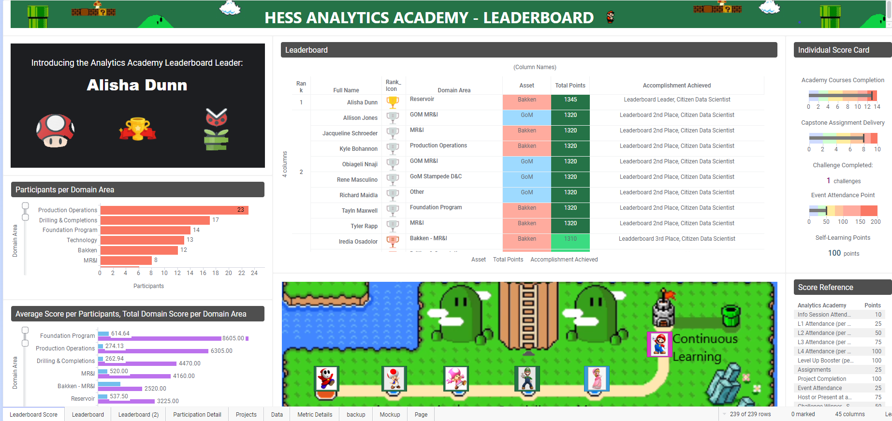

# Welcome! 
#### Please see the examples below for data science, sql query and data analysis with reporting

##    Python (Databricks and Jupyter Notebook)
### Machine Learning:

### 1. Tubing Failure Prediction Model with Economic Value Optimization
####  [Databricks - Tubing Failure Classification Prediction Model](https://github.com/dzheng616/data_is_the_new_oil/blob/61b48bb9b1108491578146c883525540afaacd5d/Python/Databricks-Classification%20Prediction%20(XGboost).ipynb)
#####  (Data Import and Preparation, Grid Search and Hyperparameter Tuning, Model Interpretaion and Economic Value Calculation...)

#####  In this project, the goal is to re-train a model for predicting tubing failures and set up automatic process for further model update. To do so, the following analysis were performed:
###### - Load data and features from Azure Data Warehouseto Databricks. Data prepared for modeling and separated into training, testing and validation dataset. Sampling steps are taken to address data distribution.  
###### - Modeling with grid search and cross validation are applied to XGboost model for optimization. XGboost is chosen from many iteration test (Random Forest, XGBoost, GBC, Logistic Regression and etc.) 
###### - Business values are calculated based on communication with end users. Model results and feature importance are interpreted for validation.  Threshold sweep is performed to optimized business value. 
###### - Compare business value generated with outdated model and automatically update to outperforming model. Communicated to customer with business value and recommendation dashboard. 
 

### 2. Time Series Feature Extration and Prediction Model 
####  [Time Series Feature Extraction and Prediction Model](https://github.com/dzheng616/data_is_the_new_oil/blob/9c262e659f99db05342f96cfd2543c6ed66c755f/Python/Time%20Series%20Feature%20Extraction%20and%20Prediction%20Model.ipynb)
#####  (Time Series Feature Calculation, Grid Search and Hyperparameter Tuning, Model and Feature Interpretaion...)

#####  Insights and predictions are needed to be drived from a high frequency sensor time seires on motor equipment. After communication with multi-disciplines SMEs and exploratary data analysis, features are being extracted. Stadnard model iteration process implemented to predict for future failures. Features and models are been studied extensively to understand the relationship between data, calculated features, and failure probability. The following steps are taken:
###### - Exploratary data analysis with SMEs. Features calculated in SQL Server Management Studio and Databricks. 
###### -  Time series features calculated and prepared for modeling.Grid search and cross validation are applied to model for optimization. XGboost is chosen from many iteration test (RNN,Random Forest, GMC and etc.) 
###### - Features and feature importance are been studied extensively with SMEs to understand relationship between features and failures. Technique such as summary plot, dependence plot, and local feature importance per predictions were used. 
###### - Communicated to customer on finding and business value recommendation. 
   

 
##    SQL (Microsoft SQL Server)
#### 1.Data Aggregation and Feature Calculation
####  [Text and Time Series Feature Calculation Query](https://github.com/dzheng616/data_is_the_new_oil/blob/23afa03705ae7397bfe668941506ef92903b91e1/SQL/Feature%20Extraction%20Sample%20Query)
######  (CTE, Windows Functions, Aggregations and more...)
##### The goal for this Microsoft SQL query is to combine 3 different data sources to prepare for motor specification analysis, each with different dimension and data type. Characteristic features are first extracted from user comment table (text data type) using string parsing functions. Time series features are then extracted and aggregated from high frequency time table. Features at last are joined based on master key table and datetime. 

##    Reporting Dashbaord (Spotfire)

####  Exploratory Data Analysis for Completion Production by Area
 
 
####  Daily Report on Newset Drilling Progress and Incidents
 
 
####  Profile, Design and Performance Comparison of Equipment Characteristic
 
 
####  Analytics Academy Champion Gameboard
 

# Thanks
